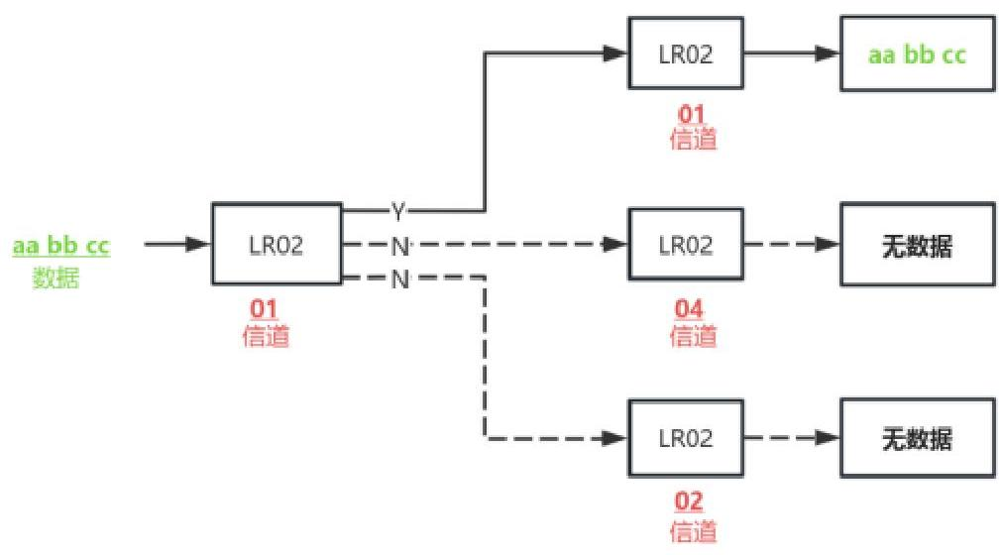

DX-SMART

# DX-LR02-900T22D Serial port application guide

Version: 1.1

Date: 2024-07-22

深圳大夏芙雀科技有限公司
SHEN ZHEN DX-SMART TECHNOLOGY CO.,LTD.
DX-LR02-900T22D 串口应用指导

Updated records

|  Version | Date | Instructions | Author  |
| --- | --- | --- | --- |
|  V1.0 | 2024/03/09 | Initial version | SML  |
|  V1.1 | 2024/07/22 | Optimize instructions | SML  |

Contact Us

SHEN ZHEN DX-SMART TECHNOLOGY CO.,LTD,
Email: manager@szdx-smart.com
Tel: 0755-2997 8125
Whatsapp:+86 15798463070
Website: en.szdx-smart.com
Address: 601, A1 Block, Huafengzhigu, Hang Kong Road, Hang Cheng Street, Baoan District, Shenzhen

- 2 -

深圳大夏龙雀科技有限公司
SHEN ZHEN DX-SMART TECHNOLOGY CO.,LTD.
DX-LR02-900T22D 串口应用指导

# Contents

1. Introduction... - 6 -
1.1. Basic parameters of serial port... - 6 -
1.2. Module default RF basic parameters... - 6 -
1.3. Transmission mode and AT command mode... - 6 -

2. PC side test tool... - 7 -
2.1. Pc-side testing software... - 7 -

3. Serial port usage... - 8 -
3.1. Module test minimum system... - 8 -
3.2. Example of module usage operation... - 9 -
3.2.1. Module to module transparent transfer... - 9 -
3.2.2. Module-to-module fixed-point transmission... - 10 -
3.2.3. Module-to-module broadcast transmission... - 11 -

4. Related AT commands explained in detail... - 13 -
4.1. Command Format Description... - 13 -
4.2. Response Format Description... - 13 -
4.3. An example of the AT command... - 13 -
4.4. List of AT commands... - 14 -

5. AT command details... - 15 -
5.1. Basic instructions... - 15 -
5.1.1. Test instructions... - 15 -

深圳大夏龙雀科技有限公司
www.szdx-smart.com

深圳大夏龙雀科技有限公司
SHEN ZHEN DX-SMART TECHNOLOGY CO.,LTD.
DX-LR02-900T22D 串口应用指导

5.1.2. Enter or exit the AT command mode... - 15 -
5.1.3. Querying configuration information... - 15 -
5.1.4. Set \ Query - Serial baud rate... - 16 -
5.1.5. Set \ Query - serial port stop bit... - 17 -
5.1.6. Set \ query - serial port parity bit... - 17 -
5.1.7. Set \ Query - Work mode... - 18 -
5.1.8. Set \ Query - Power Consumption mode... - 19 -
5.1.9. Software Restarts... - 20 -
5.1.10. factory data reset... - 20 -

5.2. Module RF parameters (one-click configuration module air rate and communication distance)... - 20 -
5.2.1. Set/Query - Configure module air rate and communication range with one click- 20 -

5.3. Module RF parameter configuration (general configuration)... - 22 -
5.3.1. Setup \ Query - Working Channel... - 22 -
5.3.2. Settings \ Query - Device Address... - 23 -
5.3.3. Set \ Query - Transmit power... - 24 -

5.4. Module RF parameter configuration (differentiated configuration)... - 24 -
5.4.1. Query - RF bandwidth... - 24 -
5.4.2. Set \ Query - RF Coding rate... - 25 -
5.4.3. Set \ Query - spread factor... - 25 -
5.4.4. Set \ query-crc check... - 26 -
5.4.5. Set \ Query - lq signal flip... - 26 -

深圳大夏龙雀科技有限公司
www.szdx-smart.com

深圳大夏龙雀科技有限公司
SHEN ZHEN DX-SMART TECHNOLOGY CO.,LTD.
DX-LR02-900T22D 串口应用指导

5.5. List of error codes... - 26 -
6. Value-added services... - 27 -

Image Index
Figure 1: Computer side serial port software Figure... - 8 -
Figure 2: Module minimum system figure... - 9 -
Figure 3: Transparent transmission Figure... - 10 -
Figure 4: Fixed-point transfer Figure... - 11 -
Figure 5: Broadcast transmission Figure... - 12 -

深圳大夏龙雀科技有限公司
www.szdx-smart.com

深圳大夏龙雀科技有限公司
SHEN ZHEN DX-SMART TECHNOLOGY CO.,LTD.

DX-LR02-900T22D 串口应用指导

# 1. Introduction

DX-LR02-900T22D is a low-power LoRa module, which is built by SHEN ZHEN DX-SMART TECHNOLOGY CO.,LTD., for intelligent wireless data transmission. It uses domestic ASR6601 SOC chip. The chip integrates SUb 1GHz RF transceiver, Arm China STAR-MC1 microprocessor, built-in Flash storage, SRAM. The module supports UART, I2C, I2S and other interfaces, supports IO port control, ADC acquisition, and has the advantages of low power consumption, high performance, long distance, networking and so on. It is suitable for a variety of application scenarios in the field of IoT, such as smart meters, intelligent logistics, intelligent buildings, smart cities, smart agriculture and many other application scenarios.

# 1.1. Basic parameters of serial port

- Default parameter of module serial port: 9600bps/8/n/1 (baud rate/data bit/no check/stop bit)

# 1.2. Module default RF basic parameters

- Module working mode: transparent transmission
- Module power consumption mode: high aging mode
- Module air speed and communication distance LEVEL gear: 0 gear
- Module frequency band: 850MHz
- Module address: ffff
- Module bandwidth: 125KHz
- Module spreading factor: SF12
- Module RF coding rate: 4/6
- Module air rate configuration: 244bit/s
- Module CRC check: No check
- Module preamble length: 8
- Module IQ signal: do not flip
- Module transmit power: 22dB

# 1.3. Transmission mode and AT command mode

深圳大夏龙雀科技有限公司
- 6 -
www.szdx-smart.com

深圳大夏龙雀科技有限公司
SHEN ZHEN DX-SMART TECHNOLOGY CO.,LTD.
DX-LR02-900T22D 串口应用指导

- Transmission mode: After the module is powered on, it is in transmission mode, at this time, it can start to transmit data.
- AT command mode: In transmission mode, use "+++" to switch to AT command mode, which can respond to AT commands. To enter the transmission mode, you need to send "+++" to exit the AT command mode.

## 2. PC side test tool

### 2.1. Pc-side testing software

Please download and install the Uart Assistant computer serial port software in the data package for testing. The serial port software interface is as follows:

深圳大夏龙雀科技有限公司
www.szdx-smart.com

深圳大夏龙雀科技有限公司
SHEN ZHEN DX-SMART TECHNOLOGY CO.,LTD.
DX-LR02-900T22D 串口应用指导

Figure 1: Computer side serial port software diagram1

# 3. Serial port usage

## 3.1. Module test minimum system

深圳大夏龙雀科技有限公司
www.szdx-smart.com

深圳大夏龙雀科技有限公司
SHEN ZHEN DX-SMART TECHNOLOGY CO.,LTD.

DX-LR02-900T22D 串口应用指导

Figure 2: Module minimum system diagram2

## 3.2. Example of module usage operation

## 3.2.1. Module to module transparent transfer

1. Connect the two DX-LR02-900T22D modules to the serial port and power supply.
2. send +++, let the module into the AT command mode.
3. use AT+MODE0 to set both modules in transparent transmission mode.
4. use AT+LEVEL to configure two LR02-900T22D modules for the same rate level, for example: set the level to 1, send instructions

AT+LEVEL1.

(Only when the RF parameters of the two modules are the same can the data be transmitted. If the parameters are configured by yourself, you can use AT+HELP to compare whether the basic RF parameters of the two modules are the same.)

5. Power off and restart the module or use AT+RESET to restart, and the instructions will take effect after restarting.
6. a module to send data, another module can receive data.

(Note: lora is a half-duplex protocol, so only one module can be sent at a time)

深圳大夏龙雀科技有限公司
- 9 -
www.szdx-smart.com

深圳大夏龙雀科技有限公司
SHEN ZHEN DX-SMART TECHNOLOGY CO.,LTD.
DX-LR02-900T22D 串口应用指导

Figure 3: Transparent transmission diagram3

信道 channel

数据 date

无数据 no date

## 3.2.2. Module-to-module fixed-point transmission

1. Connect the two DX-LR02-900T22D modules to the serial port and power supply.
2. send +++, let the module into the AT command mode.
3. use AT+MODE1 command, set the module working mode to fixed-point transmission mode.
4. use the AT+LEVEL instruction to configure the rate level of the LR02-900T22D module and make it the same, for example: set the level to 1, send the instruction AT+LEVEL1.

(Data can only be transmitted when the RF parameters of the two modules are the same. If it is the parameter configured by yourself, you can use AT+HELP to compare whether the basic RF parameters of the two modules are the same)

5. Power off and restart the module or use AT+RESET to restart, and the instructions will take effect after restarting.
6. choose the send method to HEX send.
7. Fixed-point transmission is a private protocol done on lora, so it needs to be received in accordance with a certain data transmission format.

The transmission format is described as follows: device address (hexadecimal, two bytes) + channel (hexadecimal, 1 byte) + data (hexadecimal)

深圳大夏龙雀科技有限公司
www.szdx-smart.com

深圳大夏龙雀科技有限公司
SHEN ZHEN DX-SMART TECHNOLOGY CO.,LTD.
DX-LR02-900T22D 串口应用指导

Instructions use: AT+MAC instruction, you can query or modify the device address of the current module

The AT+CHANNEL command allows you to query or modify the current module's working channel

## For example:

The address of the receiver module is 0001, and the channel is 01; The data sent by the transmitting module is aabbcc, so the data content sent is: 000101aabbcc (hexadecimal: 000101 61 61 62 62 63 63)

Figure 4: Fixed-point transmission diagram4

目标信道 Target channel

地址 address

数据 date

无数据 no date

## 3.2.3. Module-to-module broadcast transmission

1. Connect the two DX-LR02-900T22D modules to the serial port and power supply.
2. send +++, let the module into the AT command mode.
3. use AT+MODE2, set the module working mode to broadcast transmission mode.
4. Use the AT+LEVEL command to configure the rate level of the two LR02-900T22D modules and make them the same, for example: set the level to 1,

深圳大夏龙雀科技有限公司
www.szdx-smart.com

深圳大夏龙雀科技有限公司
SHEN ZHEN DX-SMART TECHNOLOGY CO.,LTD.
DX-LR02-900T22D 串口应用指导

Send instruction AT+LEVEL1.

(Only if the RF parameters of the two modules are the same can you transmit data, if it is your own configured parameters, you can use AT+HELP to compare whether the basic RF parameters of the two modules are the same)

5. Power off and restart the module or use AT+RESET to restart, and the instructions will take effect after restarting.
6. send +++, exit the AT command mode, enter the transmission mode.
7. select the send method to HEX send.
8. Broadcast transmission is a private protocol done on lora, so it needs to be received in accordance with a certain data transmission format.

The transmission format is explained as follows: channel (1 byte, hexadecimal) + data (hexadecimal)

The command uses the: AT+CHANNEL command to query or change the frequency of the current module

## For example:

The channel of the receiving module is 01, and the data sent by the transmitting module is aabbcc, so the data content sent is: 01aabbcc (hexadecimal: 01 61 61 62 62 63 63)

Figure 5: Broadcast transmission diagram5

深圳大夏龙雀科技有限公司
www.szdx-smart.com

深圳大夏龙雀科技有限公司
SHEN ZHEN DX-SMART TECHNOLOGY CO.,LTD.
DX-LR02-900T22D 串口应用指导

# 4. Related AT commands explained in detail

## 4.1. Command Format Description

AT+Command<param1, param2,="" param3=""> <cr><lf>

- All commands begin with AT and end with <cr><lf>. In the table that shows commands and responses in this document, <cr><lf> is omitted and only commands and responses are displayed.
- All AT command characters are capitalized in English.
- `&lt; &gt;` is optional content, if there are multiple arguments in the command, separated by a comma ", ", the actual command does not contain Angle brackets.
- <cr> is the carriage return character \r, which is 0X0D in hexadecimal.
- <lf> is the newline character \n, which is 0X0A in hexadecimal.
- If the instruction is executed successfully, the corresponding command is returned with the end of OK, and if it fails, EEROR=&lt;&gt; is returned, and the "&lt;&gt;" content is the corresponding error code (refer to 5.5).

## 4.2. Response Format Description

+Indication&lt;=param1, param2, param3&gt;<cr><lf>

- The response instruction begins with the plus sign "+" and ends with <cr><lf>
- Equals "=" followed by the response parameter
- If there are multiple arguments in the response argument, they are separated by a comma ","

## 4.3. An example of the AT command

Example: Modify the LoRa device baud rate to 128000

深圳大夏龙雀科技有限公司
www.szdx-smart.com</lf></cr></lf></cr></lf></cr></lf></cr></lf></cr></lf></cr>

深圳大夏龙雀科技有限公司
SHEN ZHEN DX-SMART TECHNOLOGY CO.,LTD.
DX-LR02-900T22D 串口应用指导
Send: AT+BAUD9
Return: OK

# 4.4. List of AT commands

|  Instructions | Functions | Instructions  |
| --- | --- | --- |
|  AT | Test instructions | Used to test the serial port  |
|  +++ | Enter or exit the AT command mode | Power on defaults to transmission mode  |
|  AT+HELP | Query basic module configuration information | -  |
|  AT+BAUD | Set \ Query baud rate | Default: 4 (9600)  |
|  AT+STOP | Set \ Query serial port stop bit | Default: 0 (0 stop bit)  |
|  AT+PARI | Set \ Query serial port check bits | Default: 0 (no parity)  |
|  AT+MODE | Set \ Query working mode | Default: 0 (transparent transfer)  |
|  AT+SLEEP | Set \ Query Power mode | Default: 2 (high aging mode)  |
|  AT+RESET | Software restart | -  |
|  AT+DEFAULT | factory data reset | -  |
|  AT+LEVEL | Set \ Query module air rate and communication distance | Default: 0  |
|  AT+CHANNEL | Set \ Query working channel | Default: 00  |
|  AT+MAC | Set \ Query device address | Default: ff,ff  |
|  AT+POWE | Set \ Query transmit power | Default: 22dB  |
|  AT+BW | Query RF bandwidth | Default: 0  |
|  AT+CR | Set \ Query RF coding rate | Default: 2  |
|  AT+SF | Set \ Query spread spectrum factor | Default: 12  |
|  AT+CRC | Set \ Query CRC check | Default: 0  |
|  AT+IQ | Set \ Query whether the lq signal is flipped | Default: 0  |

深圳大夏龙雀科技有限公司
www.szdx-smart.com

深圳大夏龙雀科技有限公司
SHEN ZHEN DX-SMART TECHNOLOGY CO.,LTD.
DX-LR02-900T22D 串口应用指导

# 5. AT command details

## 5.1. Basic instructions

### 5.1.1. Test instructions

|  Function | Instructi ons | Response | Instructions  |
| --- | --- | --- | --- |
|  Testing | AT | OK |   |

### 5.1.2. Enter or exit the AT command mode

|  Features | Instructi ons | Response | Instructions  |
| --- | --- | --- | --- |
|  Enter or exit the AT command mode | +++ | Exit AT
or
Entry AT | Exit AT: Exit AT command mode
Entry AT: Enter the AT command mode
Power on defaults to transmission mode  |

**Notes:**

1.  It will be reset automatically when you exit the AT command mode.
2.  The command will not be saved when the power is off.

### 5.1.3. Querying configuration information

|  Features Instructions |   | Response | Instructions  |
| --- | --- | --- | --- |
|  Query |  | ================= | LoRa Parameter: LoRa  |
|  basic |  | LoRa Parameter: | parameter  |
|  module | AT+HELP | +VERSION=<version> | <version> : Version  |
|  configura tion |  | MODE:<mode> | <mode> : Data sending mode  |
|   |  | LEVEL:<level> | <level> : Air rate configuration  |

深圳大夏龙雀科技有限公司
www.szdx-smart.com

深圳大夏龙雀科技有限公司
SHEN ZHEN DX-SMART TECHNOLOGY CO.,LTD.
DX-LR02-900T22D 串口应用指导

|  information | SLEEP: |   |
| --- | --- | --- |
|   | Frequency: |   |
|   | MAC: |   |
|   | Bandwidth: |   |
|   | Spreading Factor: |   |
|   | Coding rate: |   |
|   | CRC: | Spreading factor  |
|   | Preamble: |   |
|   | IQ: | frequency coding rate  |
|   | Power: |   |
|  |   |   |
|  |   |   |

# Examples:

Query module basic information

Send: AT+HELP

Return to: ==================================

LoRa Parameter:

+ VERSION = V1.0.0

MODE:0

LEVEL:0 &gt;&gt; 244.140625bps

SLEEP:2

Frequency:850000000hz &gt;&gt; 0

MAC:ffff

Bandwidth:0

Spreading Factor:12

Coding rate:2

CRC:0(false)

Preamble:8

IQ:0(false)

Power:22dBm

# 5.1.4. Set \ Query - Serial baud rate

深圳大夏龙雀科技有限公司
www.szdx-smart.com

深圳大夏龙雀科技有限公司
SHEN ZHEN DX-SMART TECHNOLOGY CO.,LTD.
DX-LR02-900T22D 串口应用指导

|  Features | Instructions | Response | Instructions  |   |
| --- | --- | --- | --- | --- |
|  Query baud rate | AT+BAUD | +BAUD=<baud> | <baud> The baud rate corresponds to the serial number  |   |
|  Set baud rate | AT+BAUD<baud> | OK | 1: 1200 | 6: 38400  |
|   |   |   |  2: 2400 | 7: 57600  |
|   |   |   |  3: 4800 | 8: 115200  |
|   |   |   |  4: 9600 | 9: 128000  |
|   |   |   |  5: 19200 |   |
|   |   |   |  Default: 4(9600)  |   |

**Notes:**

After setting this instruction, it should be restarted to take effect.

## 5.1.5. Set \ Query - serial port stop bit

|  Features | Instructions | Response | Instructions  |
| --- | --- | --- | --- |
|  Query the serial port stop bit | AT+STOP | +STOP=<param> | < param> sequence number  |
|  Set the serial port stop bit | AT+STOP<param> | OK | 0:1 stop bit  |
|   |   |   |  1:2 stop bits  |
|   |   |   |  Default: 0  |

**Notes:**

After setting this instruction, it should be restarted to take effect.

## 5.1.6. Set \ query - serial port parity bit

|  Features | Instructions | Response | Instructions  |
| --- | --- | --- | --- |
|  Query the serial port check bit | AT+PARI | +PARI=<param> | < param> sequence number  |
|  Set the serial port check bit | AT+PARI<param> | OK | 0: No validation  |
|   |   |   |  1: odd check  |
|   |   |   |  2: Even check  |
|   |  |  | Default: 0  |

深圳大夏龙雀科技有限公司
www.szdx-smart.com

深圳大夏龙雀科技有限公司
SHEN ZHEN DX-SMART TECHNOLOGY CO.,LTD.
DX-LR02-900T22D 串口应用指导

# Remarks:

After setting this instruction, it should be restarted to take effect.

## 5.1.7. Set \ Query - Work mode

|  Features | Instructions | Response | Instructions  |
| --- | --- | --- | --- |
|  Query working mode | AT+MODE | +MODE=<param> | param: 0,1,2
0: Transparent transmission  |
|  Set working mode | AT+MODE<param> | +MODE=<param>
OK | 1: Fixed-point transmission
2: Broadcast transmission
Default setting: 0  |

## Notes:

1. After setting this instruction, it should be restarted to take effect.
2. Transparent transmission data format: Send data directly
3. Fixed-point transmission data format: device address (hexadecimal, two bytes) + channel number (hexadecimal, one byte) + data (hexadecimal)
4. Broadcast transmission data format: channel number (hexadecimal, one byte) + data (hexadecimal)

## Examples:

1. Transparent transmission:

2. Fixed-point transfer:

深圳大夏龙雀科技有限公司
www.szdx-smart.com

深圳大夏龙雀科技有限公司
SHEN ZHEN DX-SMART TECHNOLOGY CO.,LTD.
DX-LR02-900T22D 串口应用指导

3. Broadcast transmission:

5.1.8. Set \ Query - Power Consumption mode

|  Functions | Instructions | Response | Notes  |
| --- | --- | --- | --- |
|  Querying power consumption mode | AT+SLEEP | +SLEEP=<param> | < param> serial number
0: Sleep mode
1: Air wake-up mode  |
|  Set Power mode | AT+SLEEP<param> | OK | 2: High Time mode
Default value: 2  |

Notes:
1. Sleep mode: In this mode, both MCU and RF enter the sleep state. Use the serial port to wake up, that is, when the serial port receives data, the module wakes up automatically. This mode does not write to save, every time you enter the sleep mode, you need to use the command to enter.
2. Air wake-up mode:

深圳大夏龙雀科技有限公司
www.szdx-smart.com

深圳大夏龙雀科技有限公司
SHEN ZHEN DX-SMART TECHNOLOGY CO.,LTD.
DX-LR02-900T22D 串口应用指导

A. In this mode, the module performs CAD detection in a cycle of four seconds (the overall sleep time is: 4s minus CAD detection time). If the module detects data, it will enter the receiving mode, and automatically enter the sleep after receiving data. During the sleep period, the RF will sleep, and the MCU will not sleep.

B. When the air wake-up mode is used, both the receiver and the sender should be in the air wake-up mode before they can receive and send data.

C. This mode can be written and saved.

3. High aging mode: in this mode, the module is always in the receiving state and can receive data from other devices at any time. When the serial port of the module receives the data from the master control, it switches to the transmitting state, and transmits the data out. After the transmission is completed, it switches back to the receiving state.

Note: CAD explanation: LoRa CAD (Channel Activity Detection) is a technology used to detect channel activity in LoRa network. It is used to determine whether there is activity (such as transmission by other devices) on a specified physical channel to help the device choose the right time to send and avoid collisions.

## 5.1.9. Software Restarts

|  Features | Instructions | Response | Instructions  |
| --- | --- | --- | --- |
|  Software restart | AT+RESET | OK
Power On |   |

## 5.1.10. factory data reset

|  Features | Instructions | Response | Instructions  |
| --- | --- | --- | --- |
|  factory data | AT+DEFAULT | OK
Power On |   |
|  reset |  |  |   |

## 5.2. Module RF parameters (one-click configuration module air rate and communication distance)

### 5.2.1. Set/Query - Configure module air rate and communication range with one click

深圳大夏龙雀科技有限公司
www.szdx-smart.com

深圳大夏龙雀科技有限公司
SHEN ZHEN DX-SMART TECHNOLOGY CO.,LTD.
DX-LR02-900T22D 串口应用指导

|  Functions | Instructions | Response | Instructions  |
| --- | --- | --- | --- |
|  Query module parameters | AT+LEVEL | +LEVEL = <param> | <param> : 0-7, Air rate and communication range configuration, there are eight gears Default value: 0  |
|  Set module parameters | AT+LEVEL <param> | OK |   |

# Notes:

1. You can choose different gears according to your own data volume and communication distance (data volume and distance can refer to the table below). The larger the air character rate, the faster the amount of data that can be sent.
2. the command will RF bandwidth, RF coding rate, spread spectrum factor has been set, can be used directly.
3. The LEVEL of transmitting equipment and receiving equipment should be consistent to receive and send data.
4. After setting the instruction, it needs to be restarted.

Note: The following table is the configuration parameters under different gear under the premise of coding rate CR=4/6, the following outdoor distance (open visible distance) and urban distance are for reference only, the actual distance is subject to the actual measurement.

|  LEVEL(gear) | SF(spread spectrum factor) | BW(bandwidth KHz) | Air character rate (bit/s) | Outdoor distance (Km) | Distance within city (Km)  |
| --- | --- | --- | --- | --- | --- |
|  0 | 12 | 125 | 244 | 8.0 | 2.9  |
|  1 | 11 | 125 | 447 | 7.5 | 2.85  |
|  2 | 10 | 125 | 813 | 5.7 | 2.6  |
|  3 | 9 | 125 | 1464 | 5.3 | 2.5  |
|  4 | 8 | 125 | 2604 | 5.2 | 2.5  |
|  5 | 7 | 125 | 4557 | 5.0 | 1.3  |
|  6 | 6 | 125 | 7812 | 4.1 | 0.59  |
|  7 | 5 | 125 | 13020 | 3.8 | 0.33  |

深圳大夏龙雀科技有限公司
www.szdx-smart.com

深圳大夏龙雀科技有限公司
SHEN ZHEN DX-SMART TECHNOLOGY CO.,LTD.
DX-LR02-900T22D 串口应用指导

# 5.3. Module RF parameter configuration (general configuration)

## 5.3.1. Setup \ Query - Working Channel

|  Functions | Instructions | Response | Instructions  |
| --- | --- | --- | --- |
|  Query the working channel | AT+CHANNEL | + CHANNEL=<param> | param: 00-A2 (hexadecimal)  |
|  Set the working channel | AT+CHANNEL <param> | +CHANNEL=<param> OK | Starting at 850Mhz, And grow at 500Khz Default setting: 00  |

## Notes:

1. this module is set with 162 general channels, if you need more, please contact our company.
2. After the instruction is set, it needs to be restarted.
3. When multiple receiving devices are too close to the transmitting device, it may lead to the receiving device of different channels can receive data, so the distance between the transmitting device and the receiving device is required to be as far as possible.

Note: The following table is a comparison of the working frequency bands of different channels, unit: Mhz.

|  Channel | Operating frequency band | Channel | Operating frequency band | Channel | Operating frequency band | Channel | Operating frequency band | Channel | Operating frequency band  |
| --- | --- | --- | --- | --- | --- | --- | --- | --- | --- |
|  00 | 850 | 21 | 866.5 | 42 | 883 | 63 | 899.5 | 84 | 916  |
|  01 | 850.5 | 22 | 867 | 43 | 883.5 | 64 | 900 | 85 | 916.5  |
|  02 | 851 | 23 | 867.5 | 44 | 884 | 65 | 900.5 | 86 | 917  |
|  03 | 851.5 | 24 | 868 | 45 | 884.5 | 66 | 901 | 87 | 917.5  |
|  04 | 852 | 25 | 868.5 | 46 | 885 | 67 | 901.5 | 88 | 918  |
|  05 | 852.5 | 26 | 869 | 47 | 885.5 | 68 | 902 | 89 | 918.5  |
|  06 | 853 | 27 | 869.5 | 48 | 886 | 69 | 902.5 | 8A | 919  |
|  07 | 853.5 | 28 | 870 | 49 | 886.5 | 6A | 903 | 8B | 919.5  |
|  08 | 854 | 29 | 870.5 | 4A | 887 | 6B | 903.5 | 8C | 920  |

深圳大夏龙雀科技有限公司
www.szdx-smart.com

深圳大夏龙雀科技有限公司
SHEN ZHEN DX-SMART TECHNOLOGY CO.,LTD.

DX-LR02-900T22D 串口应用指导

## 5.3.2. Settings \ Query - Device Address

|  Features | Instructions | Response | Instructions  |
| --- | --- | --- | --- |
|  Looking up device addresses | AT+MAC | +MAC=+ | param: Hexadecimal, one byte Default setting: ffff  |
|  Set device address | AT+MAC<param>, <param> | +MAC=OK |   |

Notes:

深圳大夏龙雀科技有限公司
www.szdx-smart.com

深圳大夏龙雀科技有限公司
SHEN ZHEN DX-SMART TECHNOLOGY CO.,LTD.
DX-LR02-900T22D 串口应用指导

After setting this instruction, it should be restarted to take effect.

## Examples:

Set the module address to 0a01
Send: AT+MAC0a,01
Return: +MAC=0a01
OK

## 5.3.3. Set \ Query - Transmit power

|  Features | Instructions | Response | Instructions  |
| --- | --- | --- | --- |
|  Query transmit power | AT+POWE | +POWE=<param> | param: 0-22dB (take integer values)  |
|  Set transmit power | AT+POWE<param> | +POWE=<param> OK | Default setting: 22dB  |

## Notes:

After setting this instruction, it should be restarted to take effect.

## Examples:

Modify the transmit power to 10dB
Send: AT+POWE10
Return: +POWE=10
OK

## 5.4. Module RF parameter configuration (differentiated configuration)

### 5.4.1. Query - RF bandwidth

|  Features | Instructions | Response | Instructions  |
| --- | --- | --- | --- |
|  Querying RF | AT+BW | +BW=<param> | <param> : 0  |

深圳大夏龙雀科技有限公司
www.szdx-smart.com

深圳大夏龙雀科技有限公司
SHEN ZHEN DX-SMART TECHNOLOGY CO.,LTD.
DX-LR02-900T22D 串口应用指导

bandwidth
0:125K
Default: 0

# Notes:
For other RF bandwidth, please contact us.

## 5.4.2. Set \ Query - RF Coding rate

|  Features | Instructions | Response | Instructions  |
| --- | --- | --- | --- |
|  Query the RF coding rate | AT+CR | +CR=< td=""> | <param> : 1-4  |
|   |   |   |  1:4/5  |
|   |   |   |  2:4/6  |
|  Set the RF coding rate | AT+CR<param> | +CR=< td=""> | 3:4/7  |
|   |   |   |  4:4/8  |
|   |   |   |  Default: 2  |

# Notes:
After setting this instruction, it should be restarted to take effect.

## 5.4.3. Set \ Query - spread factor

|  Features | Instructions | Response | Instructions  |
| --- | --- | --- | --- |
|  Query the spreading factor | AT+SF | +SF=< td=""> | <param> : 5-12  |
|   |   |   |  5: SF5  |
|   |   |   |  6: SF6  |
|   |   |   |  7: SF7  |
|   |   |   |  8: SF8  |
|   |   |   |  9: SF9  |
|  Set the spreading factor | AT+SF<param> | +SF=< td=""> | 10: SF10  |
|   |   |   |  11: SF11  |
|   |   |   |  12: SF12  |
|   |   |   |  Default value: 12  |

# Remarks:

深圳大夏龙雀科技有限公司
www.szdx-smart.com

深圳大夏龙雀科技有限公司
SHEN ZHEN DX-SMART TECHNOLOGY CO.,LTD.
DX-LR02-900T22D 串口应用指导

After setting this instruction, it should be restarted to take effect.

## 5.4.4. Set \ query-crc check

|  Features | Instructions | Response | Instructions  |
| --- | --- | --- | --- |
|  Inquire about CRC validation | AT+CRC | +CRC=<param> | <param> : 0,1
0: Turns off CRC validation  |
|  Set the CRC check | AT+CRC<param> | OK | 1: Turn CRC check on Default: 0  |

**Notes:**

After setting this instruction, it should be restarted to take effect.

## 5.4.5. Set \ Query - Iq signal flip

|  Features | Instructions | Response | Instructions  |
| --- | --- | --- | --- |
|  Inquire if the lq signal is flipped | AT+IQ | +IQ = <param> | <param> : 0,1
0: The lq signal does not flip  |
|  Set lq signal flip | AT+IQ<param> | OK | 1: lq signal flips
Default: 0  |

**Notes:**

1. After setting this instruction, it should be restarted to take effect.
2. IQ explanation: IQ flip refers to the phase flip operation of the received IQ signal in LoRa communication. This operation can be performed before or after demodulation and is used to change the phase of the signal to achieve different functions or optimize performance.

## 5.5. List of error codes

The details of the error code in EEROR=&lt;&gt; are as follows:

|  Return value | Error Message Description  |
| --- | --- |
|  101 | Abnormal parameter data  |
|  102 | Instruction error  |

深圳大夏龙雀科技有限公司
www.szdx-smart.com

深圳大夏龙雀科技有限公司
SHEN ZHEN DX-SMART TECHNOLOGY CO.,LTD.
DX-LR02-900T22D 串口应用指导

# 6. Value-added services

In order to meet the various functional requirements of customers, our company can provide the following technical value-added services:

- Module program customization, such as: IO function port customization, AT instruction customization, broadcast package customization, etc.
- Module PCB hardware customization, can be customized to the hardware requirements of customer needs.
- A variety of Bluetooth program customization, can be customized according to customer needs, a full set of bluetooth software and hardware solutions.
- A full set of networking solutions customization, can be customized according to customer needs, a full set of networking, gateway solutions.

If you have the above customized requirements, please contact our business personnel directly.

深圳大夏龙雀科技有限公司
www.szdx-smart.com

