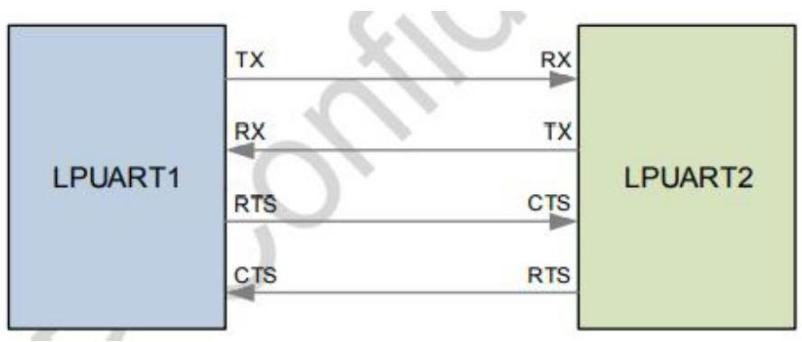
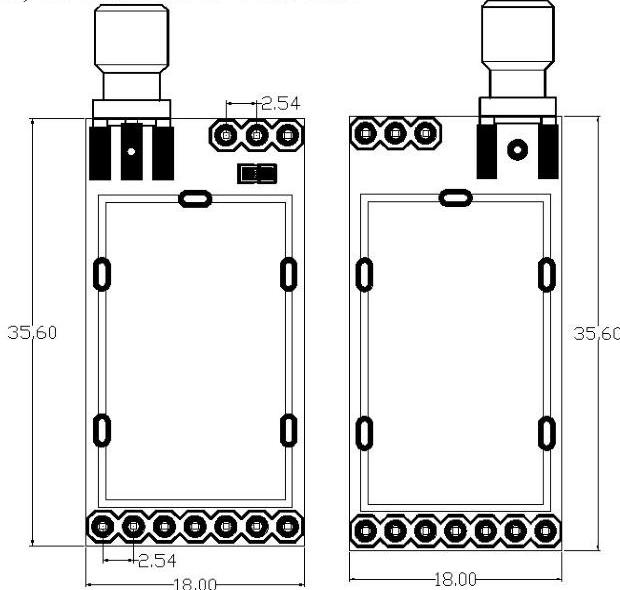

DX-SMART

# DX-LR02-900T22D
MODULE SPECIFICATION

Version: 1.1
Date: 2024-06-19

SHEN ZHEN DX-SMART TECHNOLOGY CO.,LTD.
DX-LR01-433T22S MODULE SPECIFICATION

Update Records
|  Version | Date | Description | Author  |
| --- | --- | --- | --- |
|  V1.0 | 2022/12/11 | Initial version | SML  |
|  V2.0 | 2023/03/01 | Optimizing RF parameters | SML  |

Contact Us

Shenzhen Daxia Longque Technology Co., Ltd.
Email: Manager@szdx-smart.com
TEL: 0755-2997 8125
Website: en.szdx-smart.com
Address: Room 601, Block A1, Huafeng Zhigu, Hangkong Road, Baoan District, Shenzhen

- 2 -

SHEN ZHEN DX-SMART TECHNOLOGY CO.,LTD.
DX-LR02-900T22D MODULE SPECIFICATION

# Contents

1. Introduction ... - 5 -
1.1. Overview ... - 5 -
1.2. Product Features ... - 5 -
1.3. Applications ... - 5 -
1.4. Functional Block Diagram ... - 6 -
1.5. Basic Parameter ... - 6 -
1.6. Transmission method ... - 6 -

2. Application Interface ... - 8 -
2.1. Module Pin Definition ... - 8 -
2.2. Pin Definition Description ... - 8 -
2.3. Power Design ... - 9 -
2.3.1. Power Interface ... - 9 -
2.3.2. Power Supply Stability Requirements ... - 9 -
2.3.3. AUX module RF status indicator pin description ... - 9 -
2.3.4. Power Consumption ... - 10 -
2.4. Hardware Physical Interface ... - 10 -
2.4.1. Universal Digital IO Port ... - 10 -
2.4.2. I2C Interface ... - 10 -
2.4.3. UART Interface ... - 12 -
2.4.4. SSP Interface ... - 14 -
2.4.5. LPUART ... - 15 -
2.4.6. Analog-to-digital Converter (ADC) ... - 16 -
2.5. Reference Connection Circuit ... - 18 -

3. Electrical characteristics, RF characteristics and reliability ... - 19 -
3.1. Maximum Rating ... - 19 -
3.2. Static Protection ... - 20 -

4. Mechanical Size And Layout Recommendations ... - 20 -
4.1. Module Mechanical Size ... - 20 -
4.2. Module Top View &amp; Bottom View ... - 21 -
4.3. Hardware Design Layout Recommendations ... - 21 -

5. Storage, production and packaging ... - 22 -
5.1. Storage Conditions ... - 22 -
5.2. Packing Specification ... - 23 -

Shenzhen Daxia Longque Technology Co., Ltd.
en.szdx-smart.com

SHEN ZHEN DX-SMART TECHNOLOGY CO.,LTD.
DX-LR02-900T22D MODULE SPECIFICATION

# Table index

Table 1 Basic Parameter Table ... - 6 -
Table 2 Pin definition description table ... - 8 -
Table 3 Power interface pin definition table ... - 9 -
Table 4 Power Consumption Table ... - 10 -
Table 5 Absolute maximum rating table ... - 19 -
Table 6 Recommended usage conditions ... - 19 -
Table 7 Table of ESD withstand voltage of module pins ... - 20 -

# Picture index

Figure 1 Functional Block Diagram ... - 6 -
Figure 2 Transparent Transmission ... - 7 -
Figure 3 Fixed-Point Transmission ... - 7 -
Figure 4 Broadcast Transmission ... - 8 -
Figure 5 Module pin definition ... - 8 -
Figure 6 Burst transmission power supply requirements ... - 9 -
Figure 7 IIC communication Timing diagram ... - 11 -
Figure 8 I2C Slave Timing Diagram ... - 12 -
Figure 9 IrDA Data Control ... - 13 -
Figure 10 Connection between SSP master and SPI slave ... - 14 -
Figure 11 Connection between SSI master and SSP slave ... - 15 -
Figure 12 LPUART data transmission format ... - 15 -
Figure 13 Connection between two LPUART devices ... - 16 -
Figure 14 ADC Block Diagram ... - 17 -
Figure 15 12-bit ADC timing diagram ... - 17 -
Figure 16 Typical application circuit ... - 18 -
Figure 17 Serial port level conversion reference circuit ... - 19 -
Figure 18 Recommended package dimensions top and bottom views ... - 20 -
Figure 19 Top and bottom views of the module ... - 21 -
Figure 20 Pallet size (unit: mm) ... - 23 -

Shenzhen Daxia Longque Technology Co., Ltd.
en.szdx-smart.com

SHEN ZHEN DX-SMART TECHNOLOGY CO.,LTD.
DX-LR02-900T22D MODULE SPECIFICATION

# 1. Introduction

## 1.1. Overview

DX-LR02-900T22D is a low-power LoRa module developed by Shenzhen Daxia Longque Technology Co., Ltd. for intelligent wireless data transmission. It uses the domestic ASR6601 SOC chip, which integrates a Sub 1GHz RF transceiver, Arm China STAR-MC1 microprocessor, built-in Flash storage, and SRAM. This module supports interfaces such as UART, I2C, and I2S, as well as IO port control and ADC collection. It features low power consumption, high performance, long-distance communication, and networking capabilities. It is suitable for various application scenarios in the IoT field, such as smart metering, smart logistics, smart buildings, smart cities, and smart agriculture.

## 1.2. Product Features

- ASR6601 SOC Chip
- Arm China STAR-MC1 Microprocessor
- 32-bit ARM STAR Core, Maximum Frequency 48MHz
- High power PA, Output power: +22dBm
- Maximum Receiver Sensitivity: -138dBm
- Supports UART, I2C, I2S, LPUART, SSP, QSPI interfaces
- Supports sleep mode
- External antenna
- Operating voltage: 3V-3.7 V (typical: 3.3V)
- Supports frequency range: 150-960MHz
- Line-of-sight distance up to 8km (for reference, actual distance may vary)
- Urban distance up to 3.8km (for reference, actual distance may vary)

## 1.3. Applications

- Smart metering
- Smart logistics
- Smart buildings
- Smart cities

Shenzhen Daxia Longque Technology Co., Ltd.
en.szdx-smart.com

SHEN ZHEN DX-SMART TECHNOLOGY CO.,LTD.
DX-LR02-900T22D MODULE SPECIFICATION

# 1.4. Functional Block Diagram

The following diagram is the functional block diagram of the DX-LR02-900T22D Bluetooth module, illustrating its main features:

- Power section
- Baseband section
- Memory
- RF section
- Peripheral interfaces

Figure 1 Functional Block Diagram

# 1.5. Basic Parameter

Table 1 Basic Parameter Table

|  Parameter Name | Details | Parameter Name | Details  |
| --- | --- | --- | --- |
|  Chip Model | ASR6601 | Module Model | DX-LR02-900T22D  |
|  Modulation method | Spread spectrum modulation | Module Size | 19.0(L) x 16.5 (W) x 2.4(H) mm  |
|  Operating Voltage | 3.3V-5.5V | Protocol | LoRa Protocol  |
|  Sensitivity | -138dBm | Transmit power | 0~+22dBm  |
|  RF input impedance | 50Ω | Frequency band | 850-930MHz  |
|  Antenna interface | external antenna | Hardware Interface | LPUART  |

# 1.6. Transmission method

- Transparent Transmission: the sender and receiver can transmit data if the channel is the same

Shenzhen Daxia Longque Technology Co., Ltd.
en.szdx-smart.com

SHEN ZHEN DX-SMART TECHNOLOGY CO.,LTD.
DX-LR02-900T22D MODULE SPECIFICATION

Figure 2 Transparent Transmission

- Fixed-Point Transmission: When the sending end transmits data, the target address and target channel included in the data must match the address and channel of the receiving end.

Data format: target address (hexadecimal, two bytes) + target channel (hexadecimal, one byte) + data (hexadecimal).

Figure 3 Fixed-Point Transmission

- Broadcast Transmission: When the sender sends data, the target channel in the data must be the same as the receiving channel.

Data format: target channel (one byte, hexadecimal) + data (hexadecimal)

Shenzhen Daxia Longque Technology Co., Ltd.
en.szdx-smart.com

SHEN ZHEN DX-SMART TECHNOLOGY CO.,LTD.
DX-LR02-900T22D MODULE SPECIFICATION

Figure 4 Broadcast Transmission

# 2. Application Interface

## 2.1. Module Pin Definition

Figure 5 Module pin definition

## 2.2. Pin Definition Description

Table 2 Pin definition description table

|  Pin number | Pin name | Pin function | illustrate  |
| --- | --- | --- | --- |
|  1 | M0 | Reserved | Customizable IO port  |
|  2 | M1 | Reserved | Customizable IO port  |
|  3 | UART_RX | Serial port data input | -  |
|  4 | UART_TX | Serial port data output | -  |
|  5 | AUX | Module RF status indicator pin | For details, please refer to 2.3.3  |
|  6 | VCC | Power input pin | 5V(typical value)  |

Shenzhen Daxia Longque Technology Co., Ltd.
en.szdx-smart.com

SHEN ZHEN DX-SMART TECHNOLOGY CO.,LTD.
DX-LR02-900T22D MODULE SPECIFICATION
GND
Power ground

# 2.3. Power Design

## 2.3.1. Power Interface

Table 3 Power interface pin definition table

|  Pin name | Pin number | describe | Minimum | Typical value | maximum | Unit  |
| --- | --- | --- | --- | --- | --- | --- |
|  VCC | 6 | Module power | 3 | 5 | 5.5 | V  |
|  GND | 7 | Land | - | 0 | - | V  |

## 2.3.2. Power Supply Stability Requirements

The power supply range of the DX-LR02-900T22D is 3.3~5.5V, ensuring that the input voltage is not lower than 3.3V. The following diagram illustrates the voltage drop of VVCC_3V3 during RF burst transmission.

Figure 6 Burst transmission power supply requirements

To reduce voltage drop, it is recommended to reserve two MLCCs (100uF and 0.1uF) with optimal ESR performance for VBAT, and place the capacitors close to the VBAT pin. The reference circuit is as follows:

## 2.3.3. AUX module RF status indicator pin description

- Low Level: The module is currently in a receive idle or data transmit idle state, ready for data transmission, or waiting for the remote module to send data.
- High Level: The module is currently in a data receiving or data transmission accumulation state, please wait until the pin changes to a low level.

Shenzhen Daxia Longque Technology Co., Ltd.
en.szdx-smart.com

SHEN ZHEN DX-SMART TECHNOLOGY CO.,LTD.
DX-LR02-900T22D MODULE SPECIFICATION

## 2.3.4. Power Consumption

- Sleep Mode: In this mode, both the MCU and the RF module enter a sleep state. The module can be woken up using the serial port by sending 4 bytes. This mode is not saved and must be entered using a command each time.
- Over-the-Air Wake-Up Mode: In this mode, the module performs CAD detection every four seconds (total sleep time is 4 seconds minus the CAD detection time). If the module detects data, it will enter receive mode, and after receiving the data, it will automatically return to sleep. During sleep, the RF module sleeps while the MCU does not. This mode can be saved.
- High Efficiency Mode: In this mode, the module remains in receive mode continuously, ready to receive data from other devices at any time. When the module's serial port receives data from the host controller, it switches to transmit mode to send out the data. After transmission, it switches back to receive mode.

Table 4 Power Consumption Table

|  Mode | State | Current | Unit  |
| --- | --- | --- | --- |
|  Sleep Mode | Standby | 59.15 | uA  |
|  Over-the-Air Wake-Up Mode | Standby | 4.63 | mA  |
|   |  Receive | 6.7 | mA  |
|  High Efficiency Mode | Standby | 9.71 | mA  |
|   |  Transmit | 53.5 | mA  |
|   |  Receive | 9.53 | mA  |

## 2.4. Hardware Physical Interface

### 2.4.1. Universal Digital IO Port

The module defines 20 general-purpose digital I/O pins. All these I/O pins can be configured through software to perform various functions such as button control, LED driving, or interrupt signals to the main controller. They remain floating when not in use.

### 2.4.2. I2C Interface

ASR6601 includes an I2C master mode, supporting standard rate mode (100 Kbps) and fast mode (400 Kbps), as well as multi-master and bus arbitration functions. The SDA line is for data transmission, and the SCL line is for the reference clock.

Shenzhen Daxia Longque Technology Co., Ltd.
en.szdx-smart.com

SHEN ZHEN DX-SMART TECHNOLOGY CO.,LTD.

DX-LR02-900T22D MODULE SPECIFICATION

When the software initiates a read or write operation, the I2C switches from the default slave receive mode to the master transmit mode. Following the start condition, there is a 7-bit slave address and a 1-bit R/nW bit. Upon receiving an ACK, the I2C enters one of the two modes: master transmit mode (writing data) or master receive mode (reading data).

The CPU writes to the I2Cx_CR register to initiate a master transaction. The FIFO mode can only be used in master mode. FIFO mode can be used for both transmitting and receiving, helping to reduce I2Cx_DBR register empty interrupts and full interrupts. FIFO allows multiple bytes to be read or written without interrupting the CPU after each byte operation.

Figure 8 shows the I2C timing diagram, which is the same as the I2C slave timing diagram:
Figure 7 IIC communication Timing diagram

ASR6601 also includes an I2C slave mode, supporting standard rate mode (100 Kbps) and fast mode (400 Kbps).

The default mode is slave receive, and I2Cx_CR{UE} must be set to 1. The I2C monitors the bus for a start condition. When a start condition is detected, the interface reads the first 8 bits of data and compares the first 7 bits to its own slave address. If they match, it responds with an ACK. If the 8th bit (R/nW) of the first byte is low, the I2C remains in slave receive mode and clears I2Cx_SR{SAD}. If R/nW is high, the I2C switches to slave transmit mode and sets I2Cx_SR{SAD}.

As a receiving slave, the I2C pulls the SDA line low to generate an ACK, sending it to the master when SCL is high.

Shenzhen Daxia Longque Technology Co., Ltd.

en.szdx-smart.com

SHEN ZHEN DX-SMART TECHNOLOGY CO.,LTD.
DX-LR02-900T22D MODULE SPECIFICATION

Figure 8 I2C Slave Timing Diagram

## 2.4.3. UART Interface

ASR6601 supports UART and IrDA modes. The FIFOs for transmission and reception are independent, with a 16-bit integer part for baud rate divisor and a 6-bit fractional part. It supports standard asynchronous communication settings, including 5, 6, 7, and 8 data bits, parity support, and 1 or 2 stop bits. DMA is supported, along with false start bit detection, Line Break generation and detection, and hardware flow control. Each UART port can be uniquely identified through an ID register.

The frequency of UARTCLK must meet the baud rate requirements: FUARTCLK(min) &gt;= 16 x baudrate(max), and FUARTCLK(max) &lt;= 16 x 65535 x baudrate(min).

For example, to achieve baud rates between 110 and 460800, UARTCLK frequency must be between 7.3728MHz and 115.34MHz.

Additionally, UARTCLK should not exceed 5/3 times PCLK: FUARTCLK &lt;= 5/3 * FPCLK.

The FIFOs for transmission and reception operate independently, controlled by the UARTx_LCR_H{FEN} line control register to enable or disable them. Transmission FIFO is 16 x 8 deep, reception FIFO is 16 x 12 deep, and each received character in the FIFO has a 4-bit status code. FIFO water levels can be configured via the UARTx_IFLS FIFO interrupt level select register to 1/8, 1/4, 1/2, 3/4, or 7/8 depth levels; when FIFOs are disabled, the depth is 1. FIFO status can be queried using the UARTx_FR flag register.

Shenzhen Daxia Longque Technology Co., Ltd.
en.szdx-smart.com

SHEN ZHEN DX-SMART TECHNOLOGY CO.,LTD.

DX-LR02-900T22D MODULE SPECIFICATION

The IrDA SIR ENDEC provides functionality to convert data between UART data streams and half-duplex serial SIR interfaces. It operates in two modes:

IrDA mode: Logic 0 level is converted to a high-level pulse of 3/16th of the nSIROUT baud rate bit period, and logic 1 level is converted to a low level.

Low-Power IrDA mode: High-level pulse width for transmission is 3 times the internal IrLPBaud16 period (1.63us, assuming nominal frequency of 1.842MHz).

The IrDA SIR physical layer provides half-duplex communication, with a minimum 10ms delay required between switching from transmission to reception. This delay must be managed by software, as UART does not support automatic delay.

The diagram below illustrates the modulation effect of IrDA 3/16 data modulation:

Figure 9 IrDA Data Control

To enable UART using UARTx_CR{UARTEN}, configure parameters such as data bits, stop bits, parity, etc., through the line control register UARTx_LCR_H.

When receiving, if UART RXD remains low during idle, Baud16 enables the receive counter to start counting. UART mode samples data starting from the 8th Baud16 cycle. In IrDA mode, sampling begins from the 4th Baud16 cycle to allow shorter logic 0 pulses.

If UART RXD remains low during the 8th Baud16 cycle, a valid start bit is detected; otherwise, it is considered a false start and ignored.

Shenzhen Daxia Longque Technology Co., Ltd.

en.szdx-smart.com

SHEN ZHEN DX-SMART TECHNOLOGY CO.,LTD.
DX-LR02-900T22D MODULE SPECIFICATION

Upon detecting a valid start bit, data is sampled every 16 Baud16 cycles, with the length determined by UARTx_LCR_H{WLEN}. If parity check is enabled, parity bits are compared.

Finally, when UART RXD goes high, a valid stop bit is confirmed; otherwise, a framing error occurs. The entire received character, along with error flags, is stored in the receive FIFO.

## 2.4.4. SSP Interface

ASR6601 supports the SSP (Synchronous Serial Port) interface, which operates in MASTER and SLAVE modes. It accommodates various frame formats and allows configuration of data width and output rates as needed. The interface supports a maximum output of 16 MHz and features 16-bit wide TX/RX FIFOs with a depth of 8.

The SSP interface primarily utilizes four pins: SSP_NSS, SSP_CLK, SSP_TX and SSP_RX.

- SSP_NSS: SSP chip select signal, active low.
- SSP_CLK: SSP clock signal; in MASTER mode, it serves as a clock output, while in SLAVE mode, it functions as a clock input.
- SSP_TX: SSP transmit signal, used for transmission in both MASTER and SLAVE modes.
- SSP_RX: SSP receive signal, used for reception in both MASTER and SLAVE modes.

Figure 10 Connection between SSP master and SPI slave

Shenzhen Daxia Longque Technology Co., Ltd.
en.szdx-smart.com

SHEN ZHEN DX-SMART TECHNOLOGY CO.,LTD.
DX-LR02-900T22D MODULE SPECIFICATION

Figure 11 Connection between SSI master and SSP slave

SSP Clock Constraints:

- Maximum supported output clock is 16 MHz.
- In MASTER mode, the maximum clock is 1/2 of PCLK
- In SLAVE mode, the maximum clock is 1/12 of PCLK

Here, SSPCLK refers to the interface clock of SSP, while SSPCLKOUT refers to the output clock of SSP. Taking the default 24 MHz as an example, to output a 1 MHz clock, set CPSDVR to 2 and SCR to 11.

## 2.4.5. LPUART

The module includes an LPUART interface, which is a low-power serial peripheral supporting baud rates up to 9600 with a 32K clock. In ultra-low power mode, the LPUART can also be awakened by received data. The LPUART supports CTS/RTS flow control and DMA requests.

Figure 12 LPUART data transmission format

When idle, the LPUART data line should remain high. During data transmission, the following are sent sequentially: start bit (START), data bits (DATA), parity bit (PARITY), and stop bit (STOP).

The meanings of each bit are as follows:

Shenzhen Daxia Longque Technology Co., Ltd.
en.szdx-smart.com

SHEN ZHEN DX-SMART TECHNOLOGY CO.,LTD.
DX-LR02-900T22D MODULE SPECIFICATION

- Start bit: A 0 signal is sent first to indicate the start of data transmission.
- Data bits: Depending on the configuration, 5-8 bits are sent sequentially.
- Parity bit: After the data bits, a 1-bit parity bit is sent, which can also be configured as no parity bit.
- Stop bit: Indicates the end of data transmission and can be 1 or 2 bits.

The LPUART baud rate configuration supports fractional division and is mainly configured through the LPUART_BAUD_RATE_INT and LPUART_BAUD_RATE_FRA registers. For example, with an LPUART interface clock frequency of 32.768 KHz and a baud rate of 9600, the division factor is 32768/9600 = 3.413. Thus, the LPUART_BAUD_RATE_INT register is set to 3, and the LPUART_BAUD_RATE_FRA register is set to 7 (0.413*16 = 6.608, rounded to 7).

The connection between two LPUARTs is shown in the diagram below:

Figure 13 Connection between two LPUART devices

RTS is an output signal used to indicate that the device is ready to receive data; it is active low, meaning a low level indicates the device can receive data. CTS is an input signal used to determine whether data can be sent to the other device; it is active low, meaning a low level indicates the device can send data to the other device.

The LPUART low-power wakeup includes RX low-level wakeup, valid START wakeup, and RX_DONE wakeup. These wakeup modes can be enabled by configuring the LPUART_WAKEUP_EN bit in the LPUART_CR0 register.

## 2.4.6. Analog-to-digital Converter (ADC)

The ADC is a 12-bit analog-to-digital converter that supports 8 external channels and 7 internal channels, with internal channels capable of sampling VBAT/3. It supports a maximum sampling rate of 1M. The ADC supports both single-ended and differential modes, with a single-ended range of 0.1V to 1.1V and a

Shenzhen Daxia Longque Technology Co., Ltd.
en.szdx-smart.com

SHEN ZHEN DX-SMART TECHNOLOGY CO.,LTD.
DX-LR02-900T22D MODULE SPECIFICATION

differential range of -1.0V to 1.0V. It can configure 16 sampling sequences and supports continuous, single, and non-continuous sampling modes. The ADC supports both software and hardware triggers, with configurable trigger sources. It also supports DMA requests and interrupt requests.

Figure 14 ADC Block Diagram

Figure 15 12-bit ADC timing diagram

Supports configuration in both single-ended and differential modes. External channels support both single-ended and differential modes, while internal channels support only single-ended mode. Differential channels are fixed pairs and cannot be arbitrarily paired: channels 0/1, 2/3, 4/5, and 6/7 form pairs. The only difference between single-ended and differential modes is in the sampling phase; there is no difference in the holding phase. In the final data, the differential input's highest bit is the sign bit (11-bit data bits and 1 sign bit), while the single-ended input has 12 data bits without a sign bit. The input mode is configured through the differential/single-ended selection register ADC_DIFFSEL.

Sampling modes are configured through ADC_CFGR{CONV_MODE} and support sampling sequence configuration with up to 16 channels for both single-ended and differential modes. For differential mode, only the positive (P) channel needs to be configured in the sampling sequence. The same channel can be configured multiple times in the sampling sequence to sample it multiple times per sequence. Sampling sequences are configured via the channel sampling sequence control registers ADC_SEQRO and ADC_SEQR1. Each 4-bit

Shenzhen Daxia Longque Technology Co., Ltd.
en.szdx-smart.com

SHEN ZHEN DX-SMART TECHNOLOGY CO.,LTD.
DX-LR02-900T22D MODULE SPECIFICATION

segment configures one sampling channel, with the two 32-bit registers providing a total of 64 bits, allowing configuration of up to 16 sampling channels.

- Continuous Sampling: Once triggered, it starts converting the selected input sequence continuously, automatically starting a new round after each sequence completes, until stopped by software.
- Single Sampling: Each trigger executes one sampling sequence cycle, automatically ending after the sampling is complete.
- Non-Continuous Sampling: Each ADC conversion in the sequence requires a hardware or software trigger. If a sequence completes, a new trigger will start the sequence from the beginning. In contrast, in continuous and single modes, each trigger completes a full sequence.

## 2.5. Reference Connection Circuit

Figure 16 Typical application circuit

Shenzhen Daxia Longque Technology Co., Ltd.
en.szdx-smart.com

SHEN ZHEN DX-SMART TECHNOLOGY CO.,LTD.
DX-LR02-900T22D MODULE SPECIFICATION

Figure 17 Serial port level conversion reference circuit

# 3. Electrical characteristics, RF characteristics and reliability

## 3.1. Maximum Rating

Exceeding the absolute maximum rated pressure may cause permanent damage to the equipment. These are stress ratings only and do not imply functional operation of the device under these or any other conditions beyond those specified in the datasheet. Prolonged exposure to conditions exceeding the absolute maximum ratings may affect the device's reliability.

Table 5 Absolute maximum rating table

|  parameter | Min | Max | Unit  |
| --- | --- | --- | --- |
|  VBAT | -0.2 | 5.5 | V  |
|  I/O Supply voltage (VDDIO) | -0.2 | 3.7 | V  |
|  Storage temperature range | -40 | +125 | °C  |

Table 6 Recommended usage conditions

|  parameter | Min | Typical | Max | Unit  |
| --- | --- | --- | --- | --- |
|  VBAT | 3.3 | 5 | 5.5 | V  |
|  I/O Supply voltage (VDDIO) | 3 | 3.3 | 3.7 | V  |
|  Operating temperature range(TA) | -40 | +25 | +85 | °C  |

Shenzhen Daxia Longque Technology Co., Ltd.
en.szdx-smart.com

SHEN ZHEN DX-SMART TECHNOLOGY CO.,LTD.
DX-LR02-900T22D MODULE SPECIFICATION

## 3.2. Static Protection

In module applications, electrostatic discharge (ESD) generated by human static electricity or electrostatic friction between microelectronics can discharge to the module through various pathways, potentially causing damage. Therefore, ESD protection should be taken seriously. During research, production assembly, testing processes, and especially in product design, ESD protection measures should be implemented. For instance, ESD protection should be enhanced at circuit design interfaces and vulnerable points susceptible to static discharge damage or interference. Production personnel should wear anti-static gloves and take other necessary precautions.

Table 7 Table of ESD withstand voltage of module pins

|  Test interface | Contact discharge | Air discharge | Unit  |
| --- | --- | --- | --- |
|  VBAT & GND | +4 | +8 | kV  |
|  Main antenna interface | +2.5 | +4 | kV  |

## 4. Mechanical Size And Layout Recommendations

### 4.1. Module Mechanical Size

This section introduces the mechanical dimensions of the module, all dimensions are in millimeters; for all tolerances that are not marked, the tolerance is  $\pm 0.3\mathrm{mm}$ .

Figure 18 Recommended package dimensions top and bottom views

Shenzhen Daxia Longque Technology Co., Ltd.
en.szdx-smart.com

SHEN ZHEN DX-SMART TECHNOLOGY CO.,LTD.
DX-LR02-900T22D MODULE SPECIFICATION

## 4.2. Module Top View &amp; Bottom View

Figure 19 Top and bottom views of the module

**Remark**

The above picture is for reference only. For the actual product appearance and label information, please refer to the actual module.

## 4.3. Hardware Design Layout Recommendations

The DX-LR02-900T22D module operates in the SUB-G wireless frequency band and uses an external antenna. The Voltage Standing Wave Ratio (VSWR) and efficiency of the antenna depend on the patch position.

To minimize interference with wireless transmission and reception, please consider the following points:

1. Avoid using metal for the product casing surrounding the DX-LR02-900T22D. If a partial metal casing is used, ensure that the module antenna is as far away from the metal parts as possible. Internal metal wires or metal screws should also be kept away from the module antenna.
2. The module antenna should be placed near the edge of the carrier PCB or exposed directly, avoiding placement in the center of the board.

Shenzhen Daxia Longque Technology Co., Ltd.
en.szdx-smart.com

SHEN ZHEN DX-SMART TECHNOLOGY CO.,LTD.
DX-LR02-900T22D MODULE SPECIFICATION

3. It is recommended to use insulating materials to isolate the module mounting location on the substrate, such as placing a solid silkscreen (Top Overlay) at this location.

# 5. Storage, production and packaging

## 5.1. Storage Conditions

Modules are shipped in vacuum sealed bags. The humidity sensitivity level of the module is 3 (MSL 3), and its storage must comply with the following conditions:

1. Recommended storage conditions: temperature 23±5°C, and relative humidity 35~60%.
2. Under the recommended storage conditions, the module can be stored in a vacuum sealed bag for 12 months.
3. Under workshop conditions with a temperature of 23±5°C and a relative humidity of less than 60%, the workshop life of the module after unpacking is 168 hours. Under this condition, the module can be directly subjected to reflow production or other high-temperature operations. Otherwise, the module needs to be stored in an environment with a relative humidity of less than 10% (for example, a moisture-proof cabinet) to keep the module dry.
4. If the module is under the following conditions, the module needs to be pre-baked to prevent the PCB from blistering, cracks and delamination that occurs after the module absorbs moisture and gets wet and then solders at a high temperature:
- Storage temperature and humidity do not meet the recommended storage conditions
- The module failed to complete production or storage according to Article 3 above after unpacking
- Vacuum packaging leaks, bulk materials
- Before module repair

Shenzhen Daxia Longque Technology Co., Ltd.
en.szdx-smart.com

SHEN ZHEN DX-SMART TECHNOLOGY CO.,LTD.
DX-LR02-900T22D MODULE SPECIFICATION

# 5.2. Packing Specification

DX-LR02-900T22D modules are packaged on trays and sealed in vacuum bags with desiccant and humidity cards. Each carrier tape measures 260*150*21.5 (unit: mm) and contains 20 modules. The specific specifications are as follows:

Figure 20 Pallet size (unit: mm)

Shenzhen Daxia Longque Technology Co., Ltd.
en.szdx-smart.com

