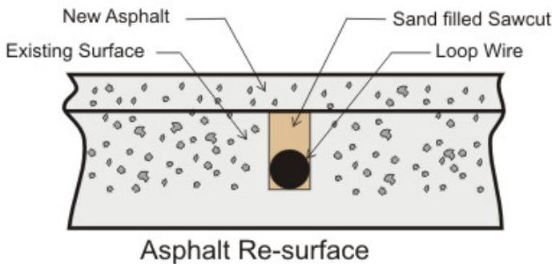

EMX

INDUSTRIES, INC.

LP D-TEK™

Low Power Vehicle Loop Detector

LPT D-TEK

# Instruction Manual

The LP D-TEK vehicle loop detector allows for detection of metallic objects entering the field formed around an induction loop. This detector offers low current consumption with an input power range of 12 VDC to 24 VAC. The LP D-TEK is made from anodized aluminum and all switches have gold plated contacts that are sealed for protection. It features full loop diagnostic with frequency counter, 10 sensitivity settings, delay mode, extend mode, fail safe/fail secure mode, automatic sensitivity boost, pulse and presence operating modes and two output relays.

# Cautions and Warnings

This product is an accessory or part of a system. Install the LP D-TEK according to instructions from the gate or door operator manufacturer. Comply with all applicable codes and safety regulations.

# Specifications

|  Power | 12-24 VDC/AC  |
| --- | --- |
|  Draw Current | 9 mA  |
|  Loop Frequency | 3 settings (low, medium, high)  |
|  Loop Induction | 20-2000 μH (Q factor ≥ 5)  |
|  Surge Protection | MOV, neon and silicon protection devices  |
|  Relay Contact Rating | 2 DPST 1A @ 30 VDC  |
|  Operating Temperature | -40° to 180°F (-40° to 82°C)  |
|  Housing Material | Anodized aluminum  |
|  Connector | 11 pin male connector (JEDEC B11-88) compatible with DIN rail mount socket or wire harness  |
|  Dimensions (L x W x H) | 3.25" (83 mm) x 2.56" (40 mm) x 3.65" (90 mm)  |

# Ordering Information

- LP D-TEK Low power vehicle loop detector (included)
- HAR-11 11 position harness, 3' of wire
- LD-11 11 pin DIN rail socket, black, wide base
- LD-11B 11 pin DIN rail socket, black, narrow base
- PR-XX Lite preformed loop (XX – specify size)
- TSTL Test loop, troubleshooting tool

Wiring Connections

|  Connector Pin | Harness | Description  |
| --- | --- | --- |
|  1 | White | Power (12-24 VDC/AC)  |
|  2 | Black | Power (12-24 VDC/AC)  |
|  3 | Orange | Relay 2 – NO (normally open contact)  |
|  4 | Green | Earth Ground  |
|  5 | Yellow | Presence – COM (common contact)  |
|  6 * | Blue | Presence – NO (normally open contact)  |
|  7 | Gray | Loop  |
|  8 | Brown | Loop  |
|  9 | Red | Relay 2 – COM (common contact)  |
|  10 ** | Pink | Presence – NC (normally closed contact)  |
|  11 | Violet | Relay 2 – NC (normally closed contact)  |

* Pin 6 is NO in fail safe and becomes NC when switched to fail secure
** Pin 10 is NC in fail safe and becomes NO when switched to fail secure

DIN Rail Socket

*Must be connected to approved earth ground for surge protection to be effective

OR
11 Wire Harness

OR

Settings &amp; Display

|  Extend Detect | DIP Switch  |   |
| --- | --- | --- |
|   |  8 | 7  |
|  No Extension | off | off  |
|  3 Second Extension | on | off  |
|  6 Second Extension | off | on  |
|  9 Second Extension | on | on  |

Extend Detect mode extends the detection after the vehicle leaves the loop for the extension time specified by DIP switch 7 and 8. When the vehicle is no longer detected and the operator enters the extended detection time period, the red LED will flash.

|  Automatic Sensitivity Boost | DIP Switch 6  |
| --- | --- |
|  ASB On | on  |
|  ASB Off | off  |
|  Automatic Sensitivity Boost | DIP Switch 5  |
| --- | --- |
|  Filter On | on  |
|  Filter Off | off  |

Automatic Sensitivity Boost mode increases the sensitivity to maximum when detection occurs. This allows for the continual detection of high bed vehicles that might otherwise not be detected. The sensitivity returns to normal after the vehicle exits the loop.

|  Filter | DIP Switch 4  |
| --- | --- |
|  Fail Safe/Fail Secure | on  |
|  Fail Safe | off  |
|  Fail Secure | off  |

Filter mode inputs a momentary delay into the detection circuit to verify that a vehicle is present in the loop for a minimum time period before activation occurs.

|  Presence | DIP Switch 3  |
| --- | --- |
|  4 Minute | on  |
|  Infinite | off  |

Fail Safe mode activates the presence output in the event of a loop failure. Fail Secure mode will not activate the presence output in the event of a loop failure and the detector will not change states on power loss or power up. In Fail Secure mode relay 2 will trigger if a loop fault occurs. Do not use Fail Secure for reversing loop applications. Note: Pin 6 and Pin 10 reverse states when switched from fail safe to fail secure.

|  Relay 2 Pulse Mode | DIP Switch 2  |
| --- | --- |
|  Pulse on Un-Detect | on  |
|  Pulse on Detect | off  |

4 Minute presence mode causes the output to reset after 4 minutes. Infinite presence mode causes the output to remain in detection mode as long as the vehicle remains near the loop. Do not use 4 Minute presence mode for reversing loop applications.

|  Relay 2 Pulse/Presence | DIP Switch 1  |
| --- | --- |
|  Presence | on  |
|  Pulse | off  |

When in pulse mode (DIP switch 1 is off), DIP switch 2 determines when the pulse occurs. When DIP switch 2 is on, Pulse on Un-Detect, relay 2 will pulse when the vehicle exits the loop. When DIP switch 2 is off, Pulse on Detect, relay 2 will pulse when the vehicle enters the loop.

DIP Switch 1 toggles between assigning the relay 2 outputs to Presence or Pulse mode.

# Sensitivity Setting

The 10-position rotary switch allows for adjustment of the detection level. The sensitivity threshold increases from position 0 (lowest setting) through 9 (highest setting). Typical applications require a setting of 3 or 4. The rotary adjustment must be set to a specific/whole number. There are no half settings.

## Power Green LED

|  No Power | off  |
| --- | --- |
|  Power | on  |
|  Previous Loop Fault | slow flash  |
|  Shorted or Open Loop | fast flash  |

The green LED is on when the device is powered up and operating correctly.

## Detect Red LED

|  No Detection | off  |
| --- | --- |
|  Detection | on  |
|  Extended Detection | flash  |
|  Frequency Count | flash  |

The red LED is on when a vehicle presence is detected and off when no presence is detected. The red LED will flash during extended detection and when the frequency counter switch is momentarily flipped up.

## Frequency Counter/ Reset Switch

Momentarily flipping the switch down calibrates the detector to the local inductance field, DIP switch settings and frequency setting. Momentarily flipping the switch up to check the operating frequency will cause the red LED to flash. Each flash represents $10\mathrm{kHz}$. (For example, 5 flashes = 50KHz operating frequency.) Counts from 3 to 13 confirm that the detector has tuned to the loop.

## Frequency Switch

The frequency switch is used to assign the loop operation frequency. The primary purpose of the frequency setting is to allow the installer the ability to set different operating frequencies for multi-loop installations and is recommended to prevent crosstalk/interference from multiple loops. To check the operating frequency, refer to the frequency counter/reset switch. Momentarily flip the RESET switch down after changing the frequency to calibrate the detector to the local inductance field.

Loop Installation

# NEW SLAB POUR

Ty-wrap 1-1/4" PVC pipe to the top of the rebar in the size and configuration of the loop (ex. 4' x 8'). Then ty-wrap the loop to the top of the PVC frame. This stabilizes the loop during the pour and separates it from the rebar.

# SAW CUT EXISTING SURFACE

Cut 1" deep into the existing surface, place a 45° cut at the corners to prevent sharp edges from damaging the loop wire. Notch out for the "T" connection where the lead wire connects to the loop. Remove all debris from the finished cut with compressed air. Place the loop into the saw cut. Place backer material into the saw cut over the loop wire and pack tightly. Place a high-quality sealer over the saw cut to seal the surface.

# RESURFACE ASPHALT

Saw cut the existing surface ¾" deep and place a 45° cut at the corners to prevent sharp edges from damaging the loop wire. Remove all debris from the finished cut with compressed air. Place sand over the loop wire to the surface and pack tightly. Lay new asphalt.

# GRAVEL OR SOIL INSTALLATION

While this is not a recommended installation for most loops, it has been used successfully with proper preparation. Remove gravel or top soil until reaching a stable base. Dig ~ 6-8" deep by ~ 6-8" wide. Fill halfway with sand and pack tightly. Place the loop into the trench and finish filling to level with sand. Pack tightly and replace gravel or soil over top.

6/8

# GENERAL INSTALLATION GUIDELINES

- Use EMX lite preformed loops for quick, reliable installations.
- It is not recommended to install a loop near power lines (overhead or underground) or low voltage lighting. If necessary near these power sources, place at a 45° angle. Make the loop shape a diamond, not a square.
- Never install a loop near inductive heaters.
- If using a non-preformed loop, lead-in wire (wire from loop to detector) must be twisted a minimum of 6 turns per foot to avoid the effects of noise or other interference.
- Detection height is approximately 70% of the shortest side of the loop.
For example: detection height for a 4' x 8' loop = 48" x .7 = 33.6"

# Installation

1. Configure DIP switch according to preferences. Refer to Settings &amp; Display section for more information.

2. Connect the 11 pin DIN rail socket or wire harness to the LP D-TEK and connect an appropriate power supply by pins 1 and 2 (white and black wire). Pin 4 (green wire) must be connected to earth ground for effective surge protection.

3. Connect the loop wires to pins 7 and 8 (gray and brown wire).

4. Connect the operator wires to the DIN rail socket or wire harness, per one of the monitoring methods below and according to the instructions provided by the operator manufacturer.

|  **Relay 1 (Presence)**
- Connect COM to pin 5 (yellow wire)
- Connect NO to pin 6 (blue wire)
- Connect NC to pin 10 (pink wire) | **Relay 2 (Pulse/Presence)**
- Connect COM to pin 9 (red wire)
- Connect NC to pin 11 (violet wire)
- Connect NO to pin 3 (orange wire)
- For Pulse, DIP switch 1 must be in off position
- For Presence, DIP switch 1 must be in on position  |
| --- | --- |

5. Adjust sensitivity setting to desired level to assure detection of all vehicle traffic. The sensitivity level increases from position 0 (lowest setting) through 9 (highest setting). Typical applications require a setting of 3 or 4. Any time the sensitivity setting changes, momentarily flip the RESET switch down to calibrate the LP D-TEK to the loop.

&gt; **TIP:**
&gt; - To test the sensitivity, without moving the sensing loop, drive a vehicle near the loop. Position the vehicle over the loop where the detection point is desired and change the sensitivity settings to the lowest setting where detection occurs.
&gt; - The rotary adjustment must be set to a specific/whole number. There are no half settings.

6. If using multiple loops or suspect crosstalk/interference from the environment, perform a frequency count on each detector to confirm that the operation frequencies are different.
- Momentarily flip up the frequency count switch and count the number of flashes of the red LED. Each flash represents 10kHz. Counts from 3 to 13 confirm that the detector is tuned to a loop.
- If multiple loops and detectors are utilizing the same or very similar frequency, change the frequency switch to a different low/high/medium setting on one of the devices. For example: Move one LP D-TEK to the low frequency setting and the second LP D-TEK to the high frequency setting.

7. Momentarily flip the RESET switch down to calibrate the LP D-TEK to the loop.

---

**Troubleshooting**

|  Symptom | Possible Cause | Solution  |
| --- | --- | --- |
|  Green LED not on | No power | Check the power supplied to the LP D-TEK on pins 1 (white wire) and 2 (black wire). Voltage should read between 12-24 VDC/AC.  |
|  Green LED fast flash | Loop wire shorted or not connected | Check the loop resistance with a multimeter to confirm a reading between 0.5 ohms and 5 ohms. If reading is outside of this range, replace the loop. The reading should be steady.
Check loop connections to terminals.
Momentarily flip the RESET switch down.  |
|  Green LED slow flash | Loop wire was previously shorted or open | Check the loop resistance with a multimeter to confirm a reading between 0.5 ohms and 5 ohms. If reading is outside of this range, replace the loop. The reading should be steady.
Momentarily flip the RESET switch down.  |
|  Red LED on constantly (stuck in detection mode) | Faulty loop
Poorly crimped connection or loose connection | Perform a megger test from loop lead to ground, it should be more than 100 megaohms.
Check loop connections to terminals. Verify splices are properly soldered and sealed against moisture.  |
|  Detector detects intermittently when no vehicle is on the loop | Faulty loop
Poorly crimped connection or loose connection
Cross-talk between multiple loop detectors
Loop not securely installed to prevent movement of loop in pavement. | Perform a megger test from loop lead to ground, it should be more than 100 megaohms.
Check loop connections to terminals. Verify splices are properly soldered and sealed against moisture.
Set multiple loops to different frequencies.
Verify that loop is securely installed in pavement and that site is in good condition preventing movement of loop wires.  |

## Warranty

EMX Industries, Inc. products have a warranty against defects in materials and workmanship for a period of two years from date of sale to our customer.

